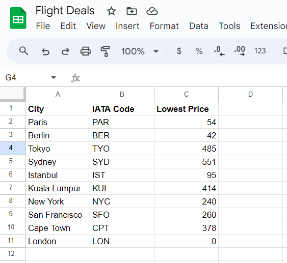
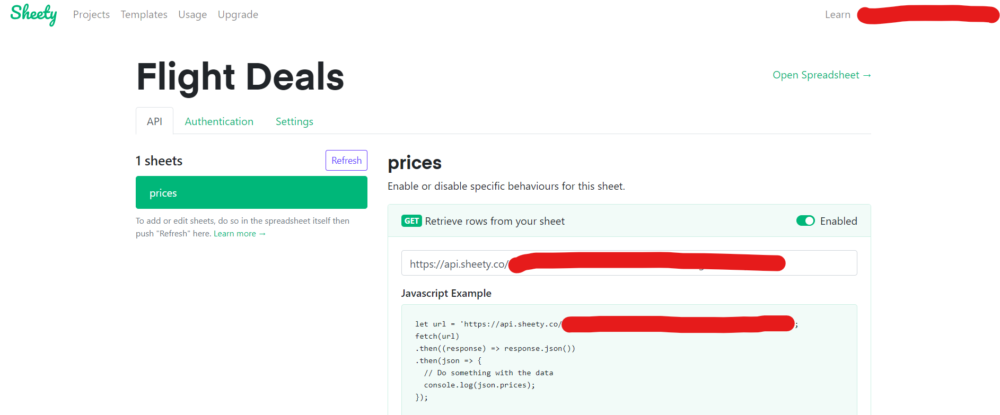
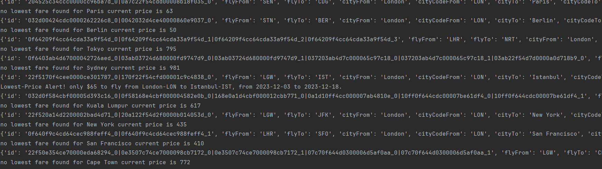

# Flight Search with API and SMS Alert through TWILLO

#### Description :  
This is just a fun/practice program can be scaled and used as you like

Idea is to get best deal for flight of favourite destination you don't have to check manually.
When you find your deal 
fare buy the tickets !

This program can be deployed in cloud (Heroku,Python Anywhere & etc) and run on specific time you will get the alert on
your mobile

To make user experience easy two API is used: 
<li>TEQUILA_API : for flight search can be customized from this link </li>

[TEQUILA_API Document](https://tequila.kiwi.com/portal/docs/tequila_api/search_api)
<li>Twillo API : sending sms I tried this in trail and working good </li>

All data required destination put into the Google sheet: 
data like your preferred destination and your target fare

you can read and write the data to Gsheet without any hassle just by using third party API which will handel all the
reading and writing data into Gsheet.   Third party API for Gsheet is [sheety](https://sheety.co/)
do explore this API very useful.  
After linking Sheet through this API this is what sheety look like

Through `request` you will get the data as JSON

copy below JSON this into this JSON [viewer](https://jsonviewer.stack.hu/)
to look response after reading and writing 
  
{
  "prices": [
    {
      "city": "Paris",
      "iataCode": "PAR",
      "lowestPrice": 54,
      "id": 2
    },
    {
      "city": "Berlin",
      "iataCode": "BER",
      "lowestPrice": 42,
      "id": 3
    },
    {
      "city": "Tokyo",
      "iataCode": "TYO",
      "lowestPrice": 485,
      "id": 4
    },
    {
      "city": "Sydney",
      "iataCode": "SYD",
      "lowestPrice": 551,
      "id": 5
    },
    {
      "city": "Istanbul",
      "iataCode": "IST",
      "lowestPrice": 95,
      "id": 6
    },
    {
      "city": "Kuala Lumpur",
      "iataCode": "KUL",
      "lowestPrice": 414,
      "id": 7
    },
    {
      "city": "New York",
      "iataCode": "NYC",
      "lowestPrice": 240,
      "id": 8
    },
    {
      "city": "San Francisco",
      "iataCode": "SFO",
      "lowestPrice": 260,
      "id": 9
    },
    {
      "city": "Cape Town",
      "iataCode": "CPT",
      "lowestPrice": 378,
      "id": 10
    },
    {
      "city": "London",
      "iataCode": "LON",
      "lowestPrice": 0,
      "id": 11
    }
  ]
}
  

Output look like this  

###### Note:
Twillo send message method is commented as it was on trial you may use your account
